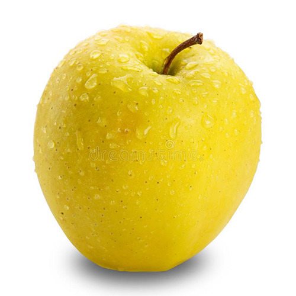

# Markdown cheatsheet

There are 6 sizes of headers:

# Header 1
## Header 2
### Header 3
#### Header 4
##### Header 5
###### Header 6

## Text formatting:

Normal text

**Bold text**

_Italic text_

## Links
### _Inline link:_

### _Reference link_:

[Click here!][link]

[link]: www.example.com

## Images:

### Inline image

### Reference image

![Green apple][Green apple]

[Green apple]: green-apple.jpg

## Quote

> "The greatest glory in living lies not in never falling, but in rising every time we fall." - Nelosn Mandela

## LIsts

### Unordered list

* Apple
* Banana
* Orange

### Ordered list

1. Wake up
2. Wash your face
3. Go to work

### Nested list

1. Maths